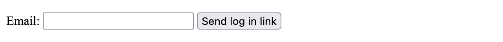
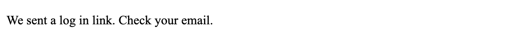

Tutorial
========

Let's get practical.

First, we'll implement :ref:`login by email <Login by email>`, also known as
"Magic Links", in a Django project. Login by email can provide a better user
experience as users generally don't forget their email address. Keep in mind
that it requires fast and reliable email delivery.

Then, we'll create :ref:`authenticated links <Authenticated links>` to share
private content without logging in a user. As an example, a vacation rentals
service could let a customer share a booking with other travelers, while not
giving them full access to the customer's account.

The two sections are independent. Once you implement the :ref:`prerequisites
<Prerequisites>`, you may proceed with the first or the second section.

Prerequisites
-------------

Create a Django project
.......................

You may work in an existing project or you may initialize a new project as follows:

.. code-block:: console

    $ django-admin startproject tutorial
    $ cd tutorial
    $ ./manage.py migrate

If you reuse an existing project, it should enable :mod:`django.contrib.auth`.

If you have a custom user model, ensure that the email address of users is
stored in a field named ``email``. Else, you will have to adapt references
to this field.

You need a user for testing. The tutorial uses ``jane.doe@example.com`` in
examples. In a new project, you can create a superuser this purpose:

.. code-block:: console

    $ ./manage.py createsuperuser

Install django-sesame
.....................

Follow the instructions in the :ref:`getting started guide <Getting started>` to
install and configure django-sesame.

Login by email
--------------

We are going to build the following login flow:

1. The user provides their email address.
2. We create an authentication token and build a magic link.
3. We email the magic link to them to confirm that they own the email address.
4. The user clicks the link, we check the token, and we log them in.

Configure short-lived tokens
............................

Before we start coding, we should think about the security of the system. Tokens
are only intended to allow the user to log in now. Let's limit their validity to
5 minutes.

Open your project settings and add this line:

.. code-block:: python

    SESAME_MAX_AGE = 600  # 600 seconds = 5 minutes

Configure redirect after login
..............................

Set the |LOGIN_REDIRECT_URL setting|__ to a URL that tells whether the user is
authenticated so you can easily tell whether login succeeds.

If you initialized a new project and you test with a superuser, you can simply
use the admin. Conveniently, it provides a link to log out:

.. |LOGIN_REDIRECT_URL setting| replace:: ``LOGIN_REDIRECT_URL`` setting
__ https://docs.djangoproject.com/en/stable/ref/settings/#std:setting-LOGIN_REDIRECT_URL

.. code-block:: python

    LOGIN_REDIRECT_URL = "/admin/"

Now we can go back to building the login flow.

Create a login form
...................

Decide where you're going to add the code. In an existing project, perhaps you
already have an app for project-wide concerns; that's a good place. Otherwise,
you can create a new app.

In this app, create a login form with only one field, the email address of the
user.

.. literalinclude:: tutorial/email_login/forms.py
    :caption: forms.py

Create templates to display the form and to show a message after submitting it
successfully.

.. |DIRS option of the TEMPLATES setting| replace:: ``DIRS`` option of the ``TEMPLATES`` setting
__ https://docs.djangoproject.com/en/stable/ref/settings/#dirs

.. literalinclude:: tutorial/email_login/email_login.html
    :caption: templates/email_login.html
    :language: html+django

.. literalinclude:: tutorial/email_login/email_login_success.html
    :caption: templates/email_login_success.html
    :language: html+django

In an existing project, you may inherit a base template and add styling.

Make sure that Django can find the templates. If needed, add the directory where
they're stored to the |DIRS option of the TEMPLATES setting|__.

Create a view to handle the form display and submission logic.

.. code-block:: python
    :caption: views.py

    from django.shortcuts import render
    from django.views.generic import FormView

    from .forms import EmailLoginForm

    class EmailLoginView(FormView):
        template_name = "email_login.html"
        form_class = EmailLoginForm

        def form_valid(self, form):
            # TODO: email magic link to user.
            return render(self.request, "email_login_success.html")

.. admonition:: Why does ``form_valid()`` ignore the Post/Redirect/Get pattern?
    :class: hint

    After handling a form submission, it is a good practice to redirect the user
    to a new URL to avoid a duplicate if the user reloads the page.

    In our case, resubmitting the form will send another Magic Link. This is a
    sensible result after refreshing a page that says "We sent a log in link."

    If you prefer to stick to Post/Redirect/Get, you can replace ``render(...)``
    with ``redirect(...)`` and add a view for rendering the success template.

Add a route to this view in your URLconf:

.. code-block:: python
    :caption: urls.py

    from django.urls import path

    from .views import EmailLoginView

    urlpatterns = [
        ...,
        path("login/", EmailLoginView.as_view(), name="email_login"),
        ...,
    ]

Check that your development server is running.

Open http://127.0.0.1:8000/login/ in a browser. You should see this form:

If you see a message saying that you are already logged in, log out.

Put an email address in the form and submit it. You should see this message:

Good. With the scaffolding in place, we can move on to the actual logic.

Generate a magic link
.....................

Now we're going to use two APIs provided by django-sesame:

- :func:`sesame.utils.get_query_string` to generate a URL query string with an
  authentication token;
- :class:`sesame.views.LoginView` to parse this query string, validate the
  token, and log the user in.

Add a route to :class:`~sesame.views.LoginView` in your URLconf. The magic link
will point to this route.

.. code-block:: python
    :caption: urls.py

    from sesame.views import LoginView

    urlpatterns = [
        ...,
        path("login/auth/", LoginView.as_view(), name="login"),
        ...,
    ]

Add logic in ``EmailLoginView.form_valid`` to look up the user with the given
email address and call :func:`~sesame.utils.get_query_string`. For now, we'll
focus on the happy path; we'll handle errors later.

.. code-block:: python
    :caption: views.py

    from django.contrib.auth import get_user_model
    from django.shortcuts import render
    from django.urls import reverse
    from django.views.generic import FormView

    from .forms import EmailLoginForm

    class EmailLoginView(FormView):
        template_name = "email_login.html"
        form_class = EmailLoginForm

        def form_valid(self, form):
            email = form.cleaned_data["email"]

            User = get_user_model()
            user = User.objects.get(email=email)

            link = reverse("login")
            link += sesame.utils.get_query_string(user)
            print("magic link:", link)

            return render(self.request, "email_login_success.html")

Open the login form, type the email of the test user, and submit the form.

In the console, you should see:

.. code-block::

    magic link: /login/auth/?sesame=AAAAAQSR1RR4dQ8Oa_2nO25r

This looks pretty good! We're missing the domain name, though, so this link
won't work in an email. Let's fix that:

.. code-block:: python
    :caption: views.py

            link = reverse("login")
            link = self.request.build_absolute_uri(link)  # add this
            link += sesame.utils.get_query_string(user)
            print("magic link:", link)

Try again. You should see:

.. code-block::

    magic link: http://127.0.0.1:8000/login/auth/?sesame=AAAAAQSR1UAocK9OxRHSjn-B

Open that link. You're logged in and redirected to |LOGIN_REDIRECT_URL|__!

Log out now so you can try logging in again later.

.. |LOGIN_REDIRECT_URL| replace:: ``LOGIN_REDIRECT_URL``
__ https://docs.djangoproject.com/en/stable/ref/settings/#std:setting-LOGIN_REDIRECT_URL

Email the magic link
....................

Instead of displaying the link in the console, let's send an email to the user:

.. code-block:: python
    :caption: views.py

            # replace print("magic link:", link) with this
            user.email_user(
                subject="[django-sesame] Log in to our app",
                message=f"""\
    Hello,

    You requested that we send you a link to log in to our app:

        {link}

    Thank you for using django-sesame!
    """)

You are following this tutorial in a development environment where you don't
usually have access to an email server.

Open your project settings and tell Django to display emails in the console
rather than send them:

.. code-block:: python

    EMAIL_BACKEND = "django.core.mail.backends.console.EmailBackend"

During local development, you will still find the magic link in the console.
When deploying to a production environment where an email server is configured,
magic links will be sent by email.

Log out and try logging in with the test user again. You should see:

.. code-block::

    Content-Type: text/plain; charset="utf-8"
    MIME-Version: 1.0
    Content-Transfer-Encoding: 7bit
    Subject: [django-sesame] Log in to our app
    From: webmaster@localhost
    To: jane.doe@example.com
    Date: Mon, 06 Jun 2022 08:10:01 -0000
    Message-ID: <165450300108.98358.6800704408988069350@53.1.168.192.in-addr.arpa>

    Hello,

    You requested that we send you a link to log in to our app:

        http://127.0.0.1:8000/login/auth/?sesame=AAAAAQSR1VluboTQNaLaBLYs

    Thank you for using django-sesame!

    -------------------------------------------------------------------------------

Click that link and check that you're logged in. Then log out.

If you're patient, you can wait five minutes for the link to expire and confirm
that it doesn't work anymore. You should get a `403 Forbidden`__ error.

__ https://docs.djangoproject.com/en/stable/ref/views/#the-403-http-forbidden-view

Improve the view
................

For reference, here's a version of ``EmailLoginView`` with error handling and
more structure.

Feel free to make your own improvements!

.. literalinclude:: tutorial/email_login/views.py
    :caption: views.py

Authenticated links
-------------------
